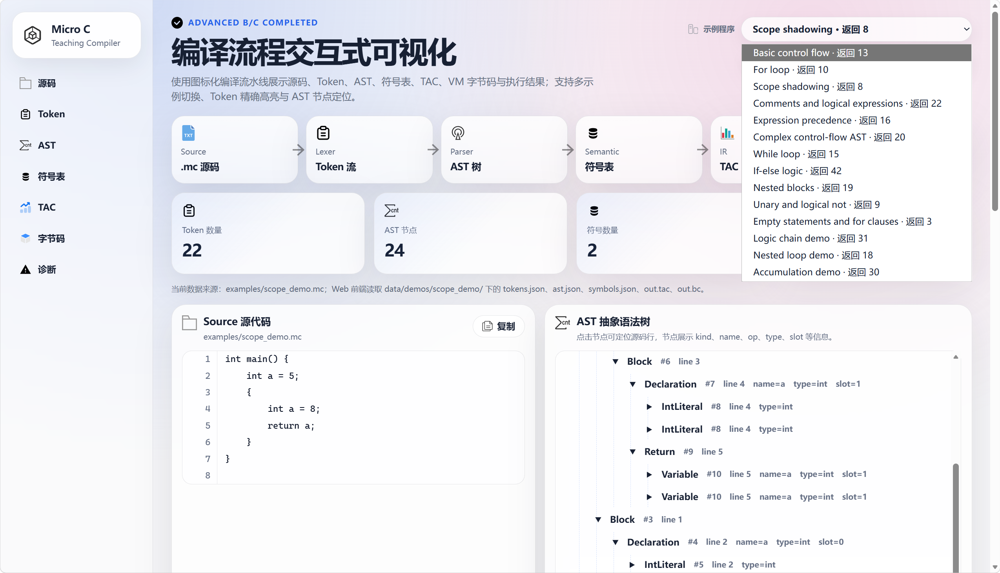
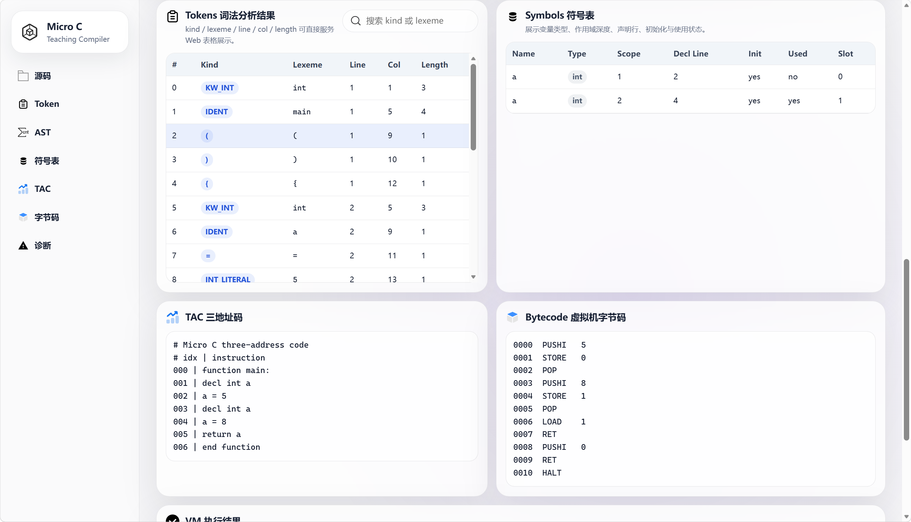
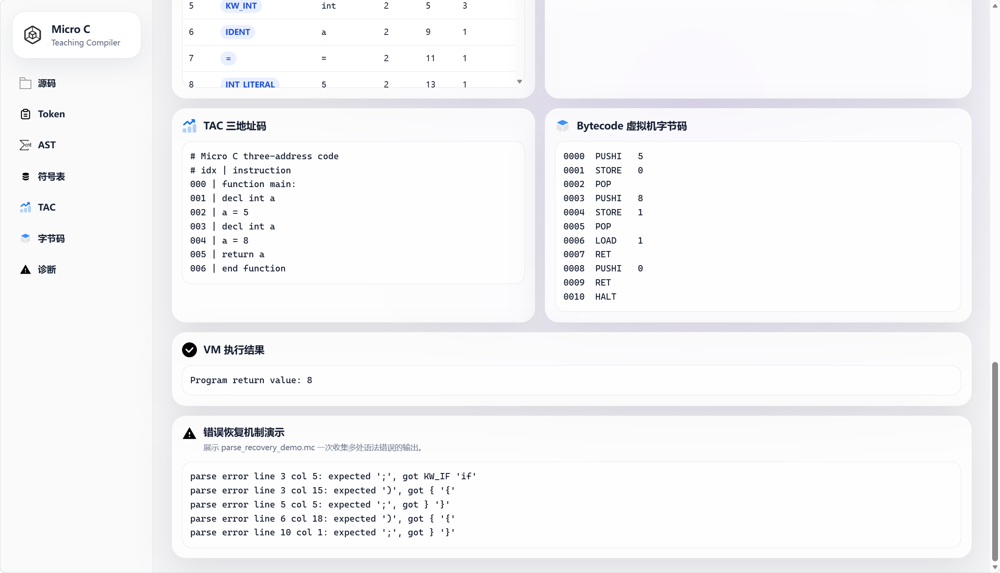
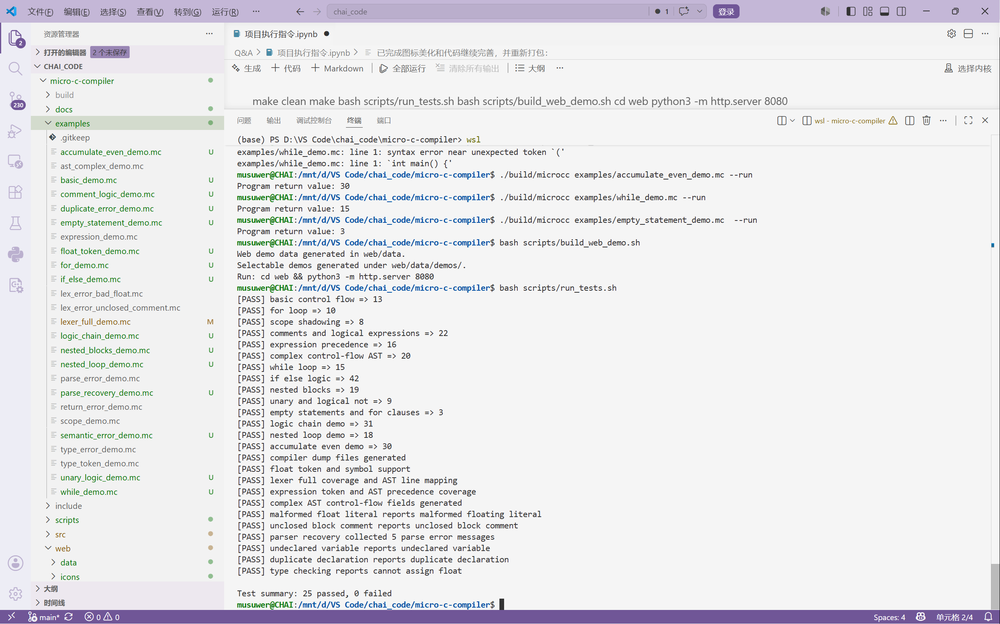

<div align="center">

# Micro C Compiler

**面向教学的微型 C 语言编译器 | C17 | 递归下降 | TAC | 自定义 VM | Web 可视化**


</div>

---

## 1. 项目简介

**Micro C Compiler** 是一个面向教学场景的微型 C 语言编译器项目，题目对应“题目 01｜面向教学的微型 C 语言编译器”。项目采用 **C17 标准**实现，目标是在课程实践周期内完成一个“可运行、可演示、可解释”的 MiniC 子集编译器。

本项目不是完整 ISO C 编译器，而是面向课堂演示和编译原理学习的 **MiniC 教学型编译器**。当前版本已经完成从 `.mc` 源代码到 Token、AST、符号表、TAC 三地址码、自定义 VM 字节码和最终运行结果的完整编译链路，并完成进阶要求 **B 错误恢复机制** 和 **C 交互式 Web 前端**。

---

## 2. 当前完成情况

| 课程要求 | 当前实现 | 主要文件 / 输出 |
|---|---|---|
| 词法分析器 | 识别关键字、标识符、整型/浮点常量、运算符、分隔符，支持单双行注释，记录 `line / col / length` | `src/lexer.c`；`tokens.json` |
| 语法分析器 | 基于递归下降法，支持声明、赋值、表达式、`if-else`、`while`、`for`、`return`、块语句、空语句 | `src/parser_ast.c`；`ast.json` |
| 语义分析 | 支持作用域、变量遮蔽、重复声明、未声明变量、`int/float` 类型检查，生成符号表 | `src/semantic.c`；`symbols.json` |
| 中间代码生成 | 输出 AST JSON 和 TAC 三地址码，使用临时变量 `t0` 和标签 `L0` 表示表达式与控制流 | `src/ir_vm.c`；`out.tac` |
| 目标代码生成 | 生成自定义栈式 VM 字节码，并由 VM 执行输出 `Program return value` | `src/ir_vm.c`；`out.bc` |
| 进阶 B | 遇到语法错误后继续分析，能够一次收集多处 `parse error` | `src/parser_ast.c`；`parse_recovery_demo.mc` |
| 进阶 C | 图标化 Web 前端，展示源码、Token、AST、符号表、TAC、字节码、执行结果，支持源码高亮联动 | `web/index.html`；`web/app.js`；`web/style.css` |

当前自动测试结果：

```text
Test summary: 25 passed, 0 failed
```

---

## 3. 编译流程

```text
MiniC 源代码 .mc
        ↓
词法分析 Lexer
        ↓
Token 流 tokens.json
        ↓
递归下降 Parser
        ↓
AST 抽象语法树 ast.json
        ↓
语义分析 Semantic Analyzer
        ↓
符号表 symbols.json
        ↓
TAC 三地址码 out.tac
        ↓
VM 字节码 out.bc
        ↓
虚拟机执行 Program return value
```

一句话概括：

> 词法分析器负责“拆单词”，语法分析器负责“组织语法结构”，语义分析器负责“检查含义是否正确”，后端负责“生成中间代码、字节码并执行”。

---

## 4. 当前支持的 MiniC 语法

| 类别 | 支持内容 | 示例 |
|---|---|---|
| 基本类型 | `int`；`float` 的词法识别、AST 表达、符号表记录和类型检查。VM 执行主要以 `int` 为主 | `int a = 1;`、`float rate = 3.14;` |
| 变量声明 | 普通声明、初始化声明 | `int total = 0;`、`int i;` |
| 赋值语句 | 变量赋值，右结合赋值表达式 | `total = total + i;` |
| 算术表达式 | `+`、`-`、`*`、`/`、`%`、括号优先级 | `2 + 3 * 4`、`(2 + 3) * 4` |
| 关系表达式 | `<`、`<=`、`>`、`>=`、`==`、`!=` | `i < 4`、`total == 20` |
| 逻辑表达式 | `&&`、`\|\|`、`!` | `total > 15 && j == 3` |
| 分支语句 | `if-else` | `if (a > 0) { ... } else { ... }` |
| 循环语句 | `while`、`for` | `while (i < 3)`、`for (i = 0; i < 5; i = i + 1)` |
| 代码块与作用域 | 嵌套 `{ ... }`，支持内层变量遮蔽外层变量 | `{ int a = 8; return a; }` |
| 返回语句 | `return expr;` | `return total;` |
| 空语句 | `;` 和部分 `for` 子句省略 | `for (; i < 3; i = i + 1) ;` |
| 注释 | 单行注释和多行注释 | `// comment`、`/* comment */` |

### 当前暂不支持

当前项目是教学型 MiniC 子集编译器，暂不支持：

```text
数组、指针、结构体、字符串、多函数、函数参数、函数调用、递归函数、预处理器、完整浮点 VM 运算。
```

这些内容工作量较大，已作为后续扩展方向写入报告和文档。

---

## 5. 能够正常编译并运行的示例文件

以下 `.mc` 文件属于**正常可编译运行程序**，可以使用：

```bash
./build/microcc examples/文件名.mc --run
```

| 序号 | 文件 | 覆盖能力 | 期望返回值 |
|---:|---|---|---:|
| 1 | `examples/basic_demo.mc` | 基础控制流 | 13 |
| 2 | `examples/for_demo.mc` | `for` 循环 | 10 |
| 3 | `examples/scope_demo.mc` | 作用域遮蔽 | 8 |
| 4 | `examples/comment_logic_demo.mc` | 注释与逻辑表达式 | 22 |
| 5 | `examples/expression_demo.mc` | 表达式优先级 | 16 |
| 6 | `examples/ast_complex_demo.mc` | `for + if-else + while + 嵌套块 + 逻辑与` | 20 |
| 7 | `examples/while_demo.mc` | `while` 循环 | 15 |
| 8 | `examples/if_else_demo.mc` | `if-else` 分支 | 42 |
| 9 | `examples/nested_blocks_demo.mc` | 嵌套代码块和作用域 | 19 |
| 10 | `examples/unary_logic_demo.mc` | 一元运算和逻辑非 | 9 |
| 11 | `examples/empty_statement_demo.mc` | 空语句和 `for` 省略项 | 3 |
| 12 | `examples/logic_chain_demo.mc` | 复合逻辑链 | 31 |
| 13 | `examples/nested_loop_demo.mc` | 嵌套循环 | 18 |
| 14 | `examples/accumulate_even_demo.mc` | `for + if + %` 累加偶数 | 30 |

### 推荐演示命令

```bash
./build/microcc examples/ast_complex_demo.mc --run
./build/microcc examples/accumulate_even_demo.mc --run
./build/microcc examples/while_demo.mc --run
./build/microcc examples/scope_demo.mc --run
```

注意：`.mc` 文件不是 Bash 脚本，不能用 `bash examples/xxx.mc` 运行。必须通过本项目生成的编译器 `./build/microcc` 运行。

---

## 6. 错误测试文件

以下文件用于验证错误处理能力，不应当作为正常程序运行：

| 文件 | 验证内容 | 期望现象 |
|---|---|---|
| `examples/lex_error_bad_float.mc` | 异常浮点数 | 输出 `malformed floating literal` |
| `examples/lex_error_unclosed_comment.mc` | 未闭合多行注释 | 输出 `unclosed block comment` |
| `examples/parse_error_demo.mc` | 基础语法错误 | 输出 `parse error` |
| `examples/parse_recovery_demo.mc` | 进阶 B 错误恢复 | 一次收集多条 `parse error` |
| `examples/semantic_error_demo.mc` | 未声明变量 | 输出 `undeclared variable` |
| `examples/duplicate_error_demo.mc` | 重复声明 | 输出 `duplicate declaration` |
| `examples/type_error_demo.mc` | `int/float` 类型不匹配 | 输出 `cannot assign float` |
| `examples/return_error_demo.mc` | return 相关语义检查 | 输出 return 相关诊断 |
| `examples/float_token_demo.mc` | 浮点 Token 与符号表检查 | 生成 `FLOAT_LITERAL` 和 `float` 符号 |
| `examples/type_token_demo.mc` | 数值类型 Token 检查 | 生成 int/float 类型相关 Token |
| `examples/lexer_full_demo.mc` | 词法覆盖测试 | 检查关键字、浮点、注释、逻辑符号、行列号 |

---

## 7. 系统效果截图

### 7.1 Web 前端整体界面与多示例切换



### 7.2 Token 表、符号表、TAC 与 VM 字节码展示



### 7.3 VM 执行结果与错误恢复机制演示



### 7.4 终端运行与自动测试结果



---

## 8. 项目结构

```text
micro-c-compiler/
├── Makefile
├── README.md
├── PROJECT_COMPLETION_CHECK.md
├── include/
│   └── microcc.h
├── src/
│   ├── main.c              # 主入口：命令行参数解析和编译流程调度
│   ├── lexer.c             # 词法分析器：Token 生成与 tokens.json 输出
│   ├── parser_ast.c        # 递归下降语法分析器：AST 生成与错误恢复
│   ├── semantic.c          # 语义分析器：符号表、作用域、类型检查
│   └── ir_vm.c             # TAC、VM 字节码和虚拟机执行
├── examples/               # 正常示例与错误测试样例
├── scripts/
│   ├── run_demo.sh         # 一键演示脚本
│   ├── run_tests.sh        # 自动测试脚本
│   └── build_web_demo.sh   # 生成 Web 展示数据
├── docs/
│   ├── ADVANCED_BC_NOTES.md
│   ├── FINAL_DEMO.md
│   └── WEB_ICON_UPDATE.md
└── web/
    ├── index.html
    ├── app.js
    ├── style.css
    ├── icons/              # 图标化 Web UI 使用的 SVG 图标
    └── data/               # Web 展示用编译结果数据
```

---

## 9. 环境准备

推荐环境：

```text
Windows 11 + WSL2 Ubuntu + VS Code + Git
```

安装依赖：

```bash
sudo apt update
sudo apt install -y build-essential make git python3
```

检查版本：

```bash
gcc --version
make --version
python3 --version
```

---

## 10. 编译与运行

### 10.1 编译项目

```bash
make clean
make
```

生成可执行文件：

```text
build/microcc
```

### 10.2 运行单个 MiniC 文件

```bash
./build/microcc examples/basic_demo.mc --run
```

输出示例：

```text
Program return value: 13
```

### 10.3 导出所有中间结果

```bash
./build/microcc examples/ast_complex_demo.mc \
  --dump-tokens build/tokens.json \
  --dump-ast build/ast.json \
  --dump-symbols build/symbols.json \
  --dump-tac build/out.tac \
  --dump-bytecode build/out.bc \
  --run
```

会生成：

```text
build/tokens.json     词法分析 Token 流
build/ast.json        AST 抽象语法树
build/symbols.json    符号表
build/out.tac         TAC 三地址码
build/out.bc          VM 字节码
```

### 10.4 运行全部测试

```bash
bash scripts/run_tests.sh
```

正常输出：

```text
Test summary: 25 passed, 0 failed
```

### 10.5 生成 Web 前端数据

```bash
bash scripts/build_web_demo.sh
```

会生成：

```text
web/data/source.mc
web/data/tokens.json
web/data/ast.json
web/data/symbols.json
web/data/out.tac
web/data/out.bc
web/data/vm_output.txt
web/data/demos/*
```

### 10.6 启动 Web 前端

```bash
cd web
python3 -m http.server 8080
```

浏览器访问：

```text
http://localhost:8080
```

### 10.7 查看 VM 执行跟踪

```bash
./build/microcc examples/ast_complex_demo.mc --trace-vm
```

`--trace-vm` 会打印 `pc`、当前字节码指令、栈状态和下一条指令位置，便于解释 VM 如何执行 TAC/字节码。

---

## 11. 命令行参数

```text
用法：./build/microcc <source.mc> [options]
```

| 参数 | 作用 |
|---|---|
| `--run` | 执行 VM 字节码，输出 `Program return value` |
| `--trace-vm` | 逐条输出 VM 执行过程 |
| `--dump-tokens <path>` | 导出 Token JSON |
| `--dump-ast <path>` | 导出 AST JSON |
| `--dump-symbols <path>` | 导出符号表 JSON |
| `--dump-tac <path>` | 导出 TAC 三地址码 |
| `--dump-bytecode <path>` | 导出 VM 字节码 |
| `--help` | 查看帮助信息 |
| `--version` | 查看版本信息 |

---

## 12. Web 前端功能

当前图标化 Web 前端实现了：

- 左侧模块导航：源码、Token、AST、符号表、TAC、字节码、诊断；
- 顶部编译流水线：Source → Lexer → Parser → Semantic → TAC → VM；
- 多示例程序切换；
- Token 表格展示和搜索；
- 点击 Token 后按 `line / col / length` 精确高亮源码片段；
- AST 树形结构展示；
- 点击 AST 节点高亮对应源码行；
- 符号表展示和声明行定位；
- TAC 与 VM 字节码展示；
- VM 执行结果展示；
- 错误恢复机制面板，展示一次收集多处语法错误的结果。

---

## 13. 十天任务清单

本项目原计划为八天核心开发，后续根据最终代码完善情况扩展为 **十天任务清单**。其中 **2026 年 7 月 5 日为周日，无开发任务**。

| Day | 日期 | 主要任务 | 负责人侧重 | 验收结果 |
|---:|---|---|---|---|
| Day 1 | 2026-06-29 | 建立项目基础结构，明确模块职责，补充基础运行说明 | A/B/C/D | `make` 与基础 demo 可运行 |
| Day 2 | 2026-06-30 | 完善词法分析，加入行号列号、异常浮点数、未闭合注释等诊断 | A 主责 | `lex error line x col y` 可输出 |
| Day 3 | 2026-07-01 | 完善表达式递归下降层级，处理算术、比较、逻辑表达式优先级 | B 主责 | `expression_demo.mc` 返回 16 |
| Day 4 | 2026-07-02 | 完善 `if/while/for` 控制流 AST，加入复杂 AST 测试 | B/D 主责 | `ast_complex_demo.mc` 可生成完整 AST |
| Day 5 | 2026-07-03 | 完善符号表、作用域管理、变量遮蔽与声明行定位 | C 主责 | `scope_demo.mc` 返回 8 |
| Day 6 | 2026-07-04 | 完善语义错误检测，包括未声明、重复声明、类型不匹配、return 检查 | C/D 主责 | 语义错误测试可通过 |
| 休息 | 2026-07-05 | 周日，无任务 | - | - |
| Day 7 | 2026-07-06 | 优化 Token/AST/Symbol JSON、TAC 格式和 VM trace | A/B/C/D | Web 前端具备数据基础 |
| Day 8 | 2026-07-07 | 完成交互式 Web 前端，展示源码、Token、AST、符号表、TAC、字节码 | A/B/C/D | AST 节点可高亮源码行 |
| Day 9 | 2026-07-08 | 最终完善与图标化 Web 增强，使用 icons 美化界面，新增示例和错误恢复展示 | A/B/C/D | `25 passed, 0 failed` |
| Day 10 | 2026-07-09 至 2026-07-10 | 完善 README、课程报告、运行截图、最终提交说明和答辩材料 | D 统筹，全员校对 | 文档、截图和最终版本可提交 |

---

## 14. Day 9 最终提交分工

| 成员 | 建议提交文件 | 具体任务 | Git commit message |
|---|---|---|---|
| 成员 A | `web/index.html`、`web/icons/*`、`web/style.css` | 使用 icons 图标资源美化 Web 前端整体页面，增加图标化侧边栏、编译流水线卡片、模块标题图标，让 Token/源码/AST/符号表/TAC/VM 展示更清晰 | `day9 web: add icon based compiler visualization UI` |
| 成员 B | `web/app.js`、`web/style.css`、`src/parser_ast.c`、`examples/parse_recovery_demo.mc` | 完善 AST 树交互、示例切换、AST 节点源码行高亮；完善进阶 B 错误恢复机制 | `day9 parser-web: enhance AST interaction and parse recovery` |
| 成员 C | `src/semantic.c`、`web/app.js`、`examples/type_error_demo.mc`、`examples/return_error_demo.mc` | 完善符号表展示、Symbol 行点击定位源码、语义错误展示；检查未声明、重复声明、类型不匹配和 return 错误 | `day9 semantic-web: improve symbol table display and diagnostics` |
| 成员 D | `src/main.c`、`scripts/*.sh`、`README.md`、`PROJECT_COMPLETION_CHECK.md`、`docs/ADVANCED_BC_NOTES.md`、新增示例 | 完成最终集成：新增 `--help`、`--version`，完善 Web 数据生成脚本，加入更多可编译示例程序，更新测试脚本和说明文档 | `day9 integration: finalize demos tests and project documentation` |

---

## 15. 小组成员与模块分工

| 成员 | 负责模块 | 核心文件 | 主要工作 |
|---|---|---|---|
| 成员 A：柴承源 | Lexer & Token & Web UI | `src/lexer.c`、`include/microcc.h`、`web/index.html`、`web/style.css`、`web/icons/` | Token 类型整理、词法错误、注释处理、Token JSON、图标化 Web UI |
| 成员 B：李嘉杰 | Parser & AST | `src/parser_ast.c`、`web/app.js` | 递归下降语法分析、表达式优先级、控制流 AST、错误恢复、AST 树交互 |
| 成员 C：张周伟 | Semantic & Symbols | `src/semantic.c`、`web/app.js` | 作用域、符号表、类型推导、语义错误、符号表展示和定位 |
| 成员 D：刘健松 | IR / VM / Tests / Docs | `src/ir_vm.c`、`src/main.c`、`scripts/*.sh`、`README.md`、`docs/` | TAC、字节码、VM trace、测试脚本、Web 数据生成、最终文档 |

---

## 16. AI 辅助开发说明

本项目允许使用 AI 辅助解释算法原理、生成测试样例、审查代码逻辑和整理文档，但核心实现需要由小组成员理解、修改、运行和验证。

| 使用场景 | AI 辅助内容 | 人工确认方式 |
|---|---|---|
| 语法分析 | 解释递归下降、表达式优先级、错误恢复同步边界 | 阅读 `parser_ast.c` 并结合 Token 流、AST JSON 手工演示 |
| 测试设计 | 生成复杂控制流、嵌套循环、类型混用、错误恢复测试思路 | 运行 `bash scripts/run_tests.sh` 验证 |
| Web 前端 | 设计图标化页面、AST 树、Token 搜索、源码高亮交互 | 浏览器访问 `http://localhost:8080` 并截图验证 |
| 报告撰写 | 整理架构说明、分工表、TAC 示例、运行步骤 | 对照最新代码包、运行截图和测试输出人工校对 |

---

## 17. 常见问题

### 17.1 为什么不能直接 `bash examples/while_demo.mc`？

`.mc` 文件是 MiniC 源代码，不是 Bash 脚本。正确运行方式是：

```bash
./build/microcc examples/while_demo.mc --run
```

### 17.2 为什么项目不支持完整 C？

本项目定位是教学型 MiniC 子集编译器，重点展示词法分析、语法分析、语义分析、TAC、字节码和 VM 执行的完整流程。数组、指针、结构体、多函数和递归函数会显著增加类型系统、内存模型和代码生成复杂度，因此作为后续扩展方向。

### 17.3 如果 Web 页面没有数据怎么办？

先在项目根目录执行：

```bash
make clean
make
bash scripts/build_web_demo.sh
```

再进入 `web` 目录启动服务：

```bash
cd web
python3 -m http.server 8080
```

---

## 18. 最终验收建议

提交或答辩前建议依次执行：

```bash
make clean
make
bash scripts/run_tests.sh
bash scripts/build_web_demo.sh
cd web
python3 -m http.server 8080
```

确认：

```text
Test summary: 25 passed, 0 failed
```

并使用浏览器打开：

```text
http://localhost:8080
```

现场演示推荐顺序：

```text
1. 展示 ast_complex_demo.mc 源码
2. 运行 ./build/microcc examples/ast_complex_demo.mc --run
3. 展示 tokens.json、ast.json、symbols.json、out.tac、out.bc
4. 打开 Web 页面，切换不同示例
5. 点击 Token / AST / Symbol，展示源码高亮
6. 展示 parse_recovery_demo.mc 的多错误恢复结果
7. 运行 bash scripts/run_tests.sh，展示 25 passed, 0 failed
```

---

## 19. 参考资料

- 东莞理工学院：《基于 AI 大模型辅助的 C 语言实践》课程题目设计
- Alfred V. Aho, Monica S. Lam, Ravi Sethi, Jeffrey D. Ullman. *Compilers: Principles, Techniques, and Tools*, 2nd Edition
- Rui Ueyama. *chibicc: A Small C Compiler*
- Nora Sandler. *Writing a C Compiler*

---

<div align="center">

**Micro C Compiler｜MiniC 教学型编译器｜进阶 B/C 完成版**

</div>
